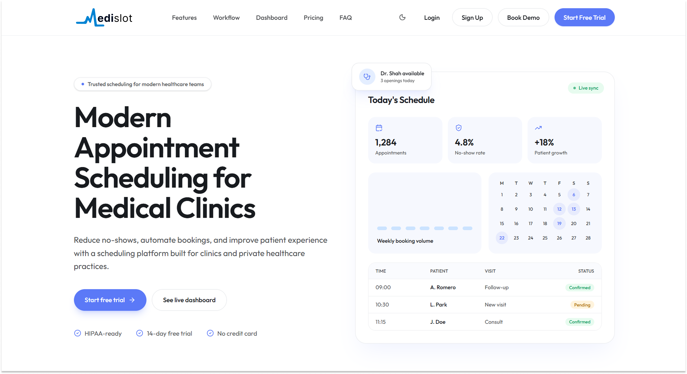
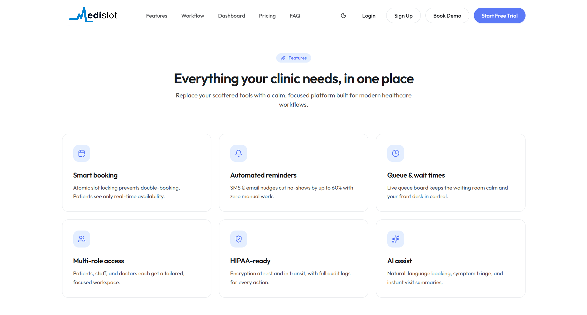
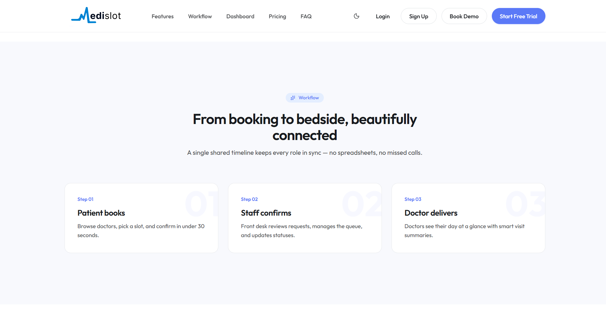
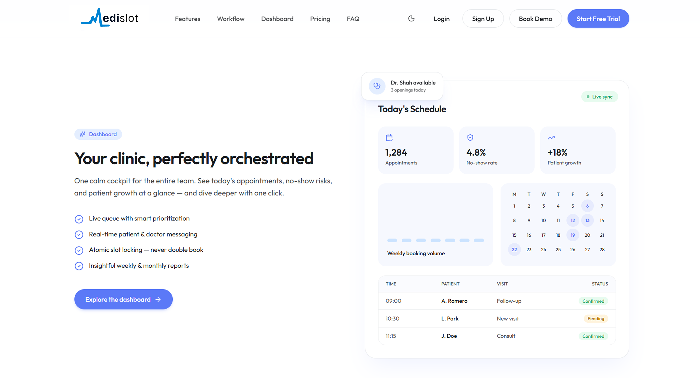
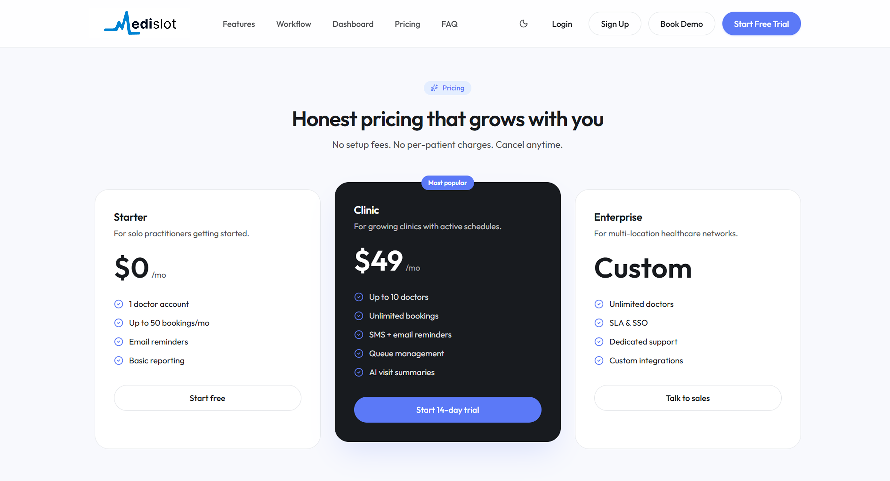
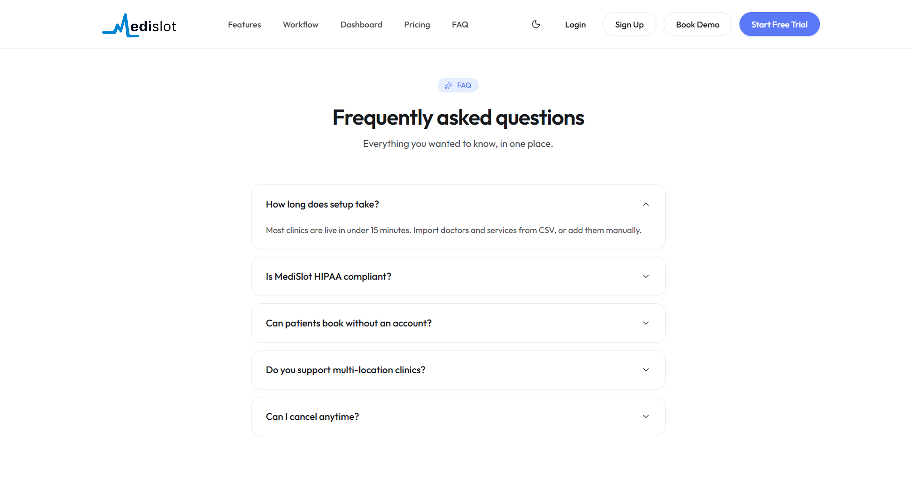
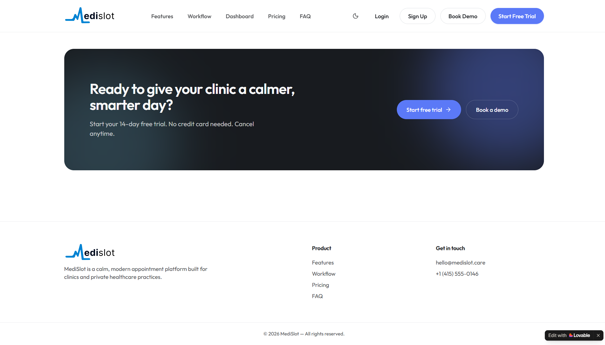

# MediSlot — Frontend

Web client for MediSlot, an appointment-scheduling SaaS for medical clinics.
Next.js (App Router) + TypeScript. All logic, auth, and data live on the FastAPI
backend — this app renders UI and calls the API.


## Landing page design

Single-page marketing site,

### Hero


### Features


### Workflow


### Dashboard


### Pricing


### FAQ


### CTA & Footer


## Roles

- Patient — dashboard, book, appointments, profile
- Doctor — dashboard, schedule, visit recordings
- Staff — dashboard, providers, services, slots, appointments, queue

## Tech stack

Next.js 16 · React 19 · TypeScript · axios · Tailwind CSS

## Getting started

```bash
echo "NEXT_PUBLIC_API_URL=http://localhost:8000" > .env.local
npm install
npm run dev
```

Open http://localhost:3000.
